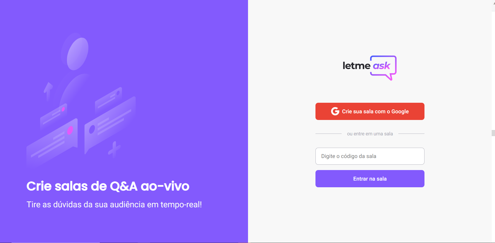
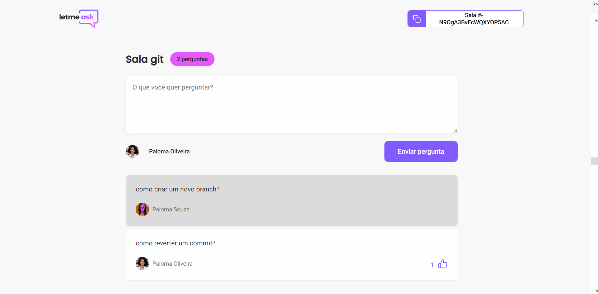
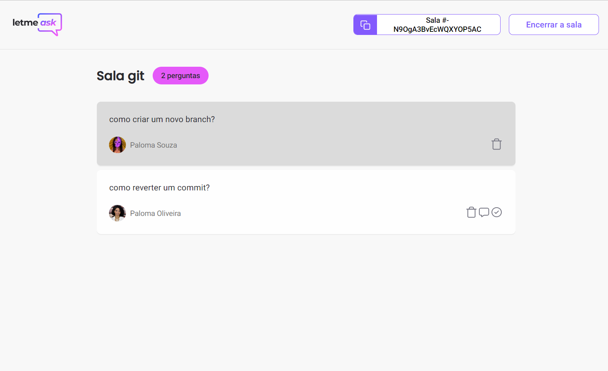

<div align="center">
  <h1 align="center">Let me ask</h1>
  
</div>

## 💻 Projeto
O letmeask é uma aplicação que permite que alguém realizando lives crie uma sala para receber perguntas, tendo maior interação com o usuário.
Veja o projeto [aqui](https://nlw-letmeask-72599.web.app/)

<br/>

---

## 🚀 Tecnologias

Esse projeto foi desenvolvido com as seguintes tecnologias:

- ReactJS
- Typescript
- Firebase
- React Testing Library
  <br/>

---

## 💻 Requerimentos

- Certifique-se de ter o [Node.js](https://nodejs.org/pt-br/) instalado.
  <br />

---

## 🏃‍♀️ Executando localmente

```bash
  # Clone o repositório
  $ git clone git@github.com:plmsz/nln-together-reactjs.git

 # Instale as dependências
  $ yarn

 # Execute a aplicação
  $ yarn start
 # Acesse em <http://localhost:3000>
```

<br/>

<!-- ---

## 🧪 Testes

<div align="center">
  
  
  
  
</div>
<br/>

---

### Executando os testes

- Para executar todos os testes execute o comando `npm run test`
- Para ver a cobertura do projeto execute o comando `npm run test:coverage`
- O relatório de cobertura será gerado dentro de `coverage/lcov-report/index.html`

## Features que implementei além do desafio

- Componente de loading
- Redirecionamento para tela de erro pelo interceptor do axios
- Botão voltar para o topo

-->
## 📱 Telas

<div align="center">
  
</div>
<div align="center">
  
</div>
<div align="center">
  
</div>

<br/> 

---

## 📫 Você pode me contatar em:

<div align="center">

</div>

</br>

<div align="center">

[](https://www.linkedin.com/in/plmsz/)
[](mailto:plmsouzaoliveira@gmail.com)
[](https://twitter.com/plmszdev)

</div>